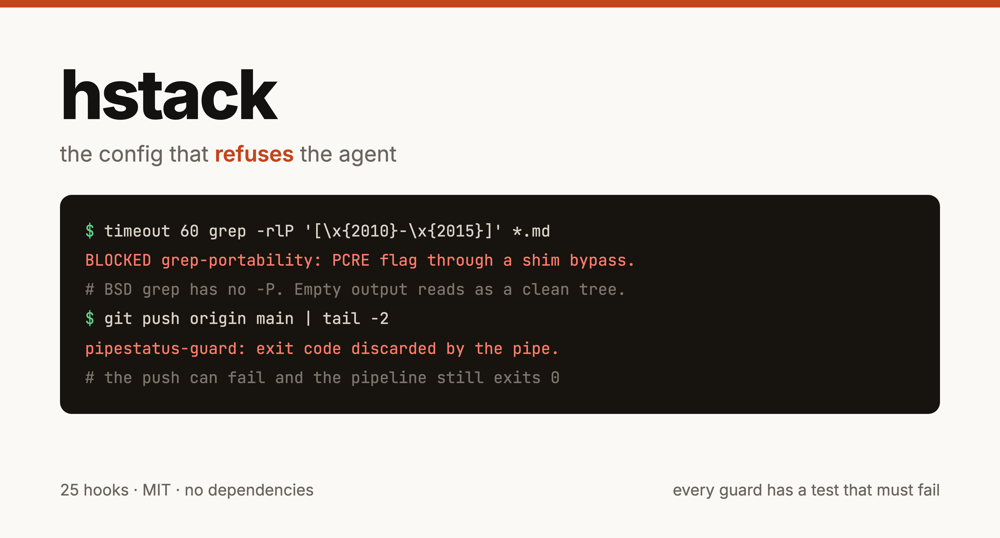

# hstack



Thirty-one Claude Code hooks that refuse the agent, and the incident behind
each one.

```bash
git clone https://github.com/howardchan2008/hstack && cd hstack
./install.sh          # copies the hooks, merges settings.json, backs it up first
./doctor.sh           # tells you which guards are actually armed
bash tests/run.sh     # proves each one still refuses what it exists to refuse
```

## Why this exists

Most Claude Code configurations are about making the agent do more: more agents,
more skills, more roles. That is the interesting half and it is well covered.

This is the other half. Every file here exists because an agent did something it
should not have, and the fix that worked was a hook that refuses, rather than a
line of prose asking it to be careful. Prose in a rules file is advice. A
PreToolUse hook is a wall.

The bar for shipping anything here: **it has refused something real.**

## The three failures these are built around

**The agent is confident and wrong at the same time.** It reports a merge as
deployed, a guard as armed, a directory as empty. Each of those was a real
sentence in a real session, and each was false in a way that looked exactly like
true. `state-verify-inject.sh` demands a live check before any claim about what
a system currently is. `wiring-verify.sh` checks the guards are armed rather
than present.

**Cost is invisible at the call site.** Every tool call re-sends the whole
conversation, so the bill is calls times context and neither number shows up
where the decision is made. One measured window: 3.62 billion cached input
tokens read back against roughly 13 million tokens of content actually produced.
`probe-dedupe.sh`, `burn-context.sh`, `lane-guard.sh` and `websearch-cache.sh`
all attack that from different sides.

**Work vanishes between turns.** A three-part prompt gets its first part
answered. An interrupt is treated as a cancel. A session ends with a dirty tree
and a report that reads as finished. `prompt-items.py`, `carryover-queue.py` and
`stop-justify.sh` exist because each of those cost a day.

## What is in here

| | |
|---|---|
| `hooks/` | 34 hooks: 16 `PreToolUse`, 2 `PostToolUse`, 4 `SessionStart`, 5 `UserPromptSubmit`, 7 `Stop` |
| `hooks.manifest.json` | the wiring, and the single source of truth for it |
| `rules/common/` | the always-loaded rules the guards enforce |
| `tests/` | a suite that fails when a guard stops refusing |
| `install.sh` `doctor.sh` | install, register, and then prove it took |
| `docs/` | one page per question: [hooks](docs/HOOKS.md), [corrections](docs/CORRECTIONS.md), [cost](docs/COST.md), [install](docs/INSTALL.md), [architecture](docs/ARCHITECTURE.md), [writing a guard](docs/WRITING-A-GUARD.md), [testing](docs/TESTING.md), [troubleshooting](docs/TROUBLESHOOTING.md) |

Full per-hook reference, with the incident and the exit codes: **[docs/HOOKS.md](docs/HOOKS.md)**.

**[docs/CORRECTIONS.md](docs/CORRECTIONS.md)** is the raw material: 101 corrections
an operator actually had to make to an agent, grouped by what the failure cost.
Most of them never became a hook, because most of them cannot be one. They are
here because the same mistake came back when only prose was written against it.

**[docs/COST.md](docs/COST.md)** is what measuring the bill produced, including the
two measurements that were wrong and the reason a saving measured once is a
saving you no longer know.

## The one that matters most

A guard that blocks everything is as useless as one that blocks nothing, and
only the second failure is visible. The first gets bypassed within a day, and
then it is decoration you argue with.

So every guard is tested twice: against the payload it must refuse, and against
an ordinary payload it must let through. Both arms fail the suite.

```
$ bash tests/run.sh
  ok   dash-gate/block                    PASS
  ok   dash-gate/allow                    PASS
  ok   ls-before-write/block-clobber      PASS
  ...
negative-control: 20/20 cases behaved
hstack: suite PASS
```

Writing that suite is how three of these guards were found to be broken. One was
scoped to a directory the test fixture never touched. One reported healthy
because the check read a status endpoint that answers before it looks at
credentials. A test that cannot fail is not a test, and it is worse than no
test, because it is trusted.

## Install

`./install.sh` copies `hooks/` and `rules/` into `~/.claude/` and merges the
registrations into `settings.json`. It backs the file up first, it is idempotent,
and `--uninstall` reverses it. `--dry-run` prints the exact change and writes
nothing.

Take one hook, take all of them, or read them and write your own. They are
independent: each reads a JSON payload on stdin and refuses by exiting 2 or by
printing a decision object. Details in [docs/INSTALL.md](docs/INSTALL.md).

Requirements: Claude Code, `bash`, and `python3` for the four python hooks and
the settings merge. Developed on macOS; the BSD-versus-GNU differences are
called out in the code where they bite.

## What has been removed

This is extracted from a working private configuration. Names, email addresses,
credential slot names, home paths and business specifics are stripped by a
scrubber that re-scans its own output and fails the build on a single surviving
match.

The scrubber does **not** ship, and that was a real bug caught before the first
publish: a scrubber's rules are a list of every private string it knows about,
so including it for transparency would have published exactly the thing it
removes. Transparency about a redaction cannot be the redaction list.

Three other leaks were caught the same way, each by a check rather than a
careful read. A venture name survived glued to a suffix, because `\b` does not
fire mid-word. Two different names collapsed into one placeholder and made the
sentence nonsense. A redaction rule for phone numbers ate 199 ISO dates, which
destroyed the provenance while looking like diligence.

The incidents keep their facts and lose their cast. "The outreach lane sent to a
contact" is a real thing that happened. The person's name is not yours to have.

## Contributing

The most useful issue you can open is a guard that failed open on you: the
payload it let through, and what it cost. That is the same evidence every hook
here was built from. See [CONTRIBUTING.md](CONTRIBUTING.md).

## Author

Built and used daily by **Howard Chan**, who runs several ventures with Claude
Code doing much of the work, which is why the failures above are specific.

Talking about agent reliability, cost control and what actually breaks in
production agent workflows: **[linkedin.com/in/howardchan2008](https://www.linkedin.com/in/howardchan2008/)**.

If one of these guards catches something on your machine, that story is worth
hearing. Send it.

## Licence

MIT.
